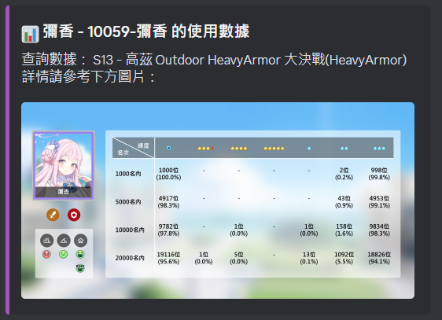

# BlueArchiveStatisticsBot


BlueArchiveStatisticsBot 是一款用於分析《Blue Archive》遊戲內總力戰與大決戰數據的 Discord Bot。

## 主要功能

- **總力戰數據查詢**
  - 查詢指定賽季的排名門檻分數。
  - 取得指定排名範圍內的角色使用統計。
  - 獲取特定角色在指定賽季的數據。

- **大決戰數據查詢**
  - 查詢指定賽季的大決戰排名門檻分數。
  - 取得指定賽季與裝甲類型的角色使用統計。
  - 獲取特定角色在指定賽季與裝甲類型的數據。

- **Excel 數據處理**
  - 透過 `data.xlsx` 處理數據。
  - 自動爬取並更新最新的數據。

## 安裝與運行

### 1. 安裝依賴套件

請確保你的環境已安裝 Python (>=3.8)，然後執行以下命令來安裝所需套件：

```bash
pip install -r requirements.txt
python3 arona_ai_helper.py
python3 DownloadSchaleDBData.py
```
### 2. 設定 Bot Token

你需要建立一個 `TOKEN.txt` 文件，並將你的 Discord Bot Token 存入該文件。格式如下：

```
YOUR_BOT_TOKEN_HERE
```

同時，還需要建立 `OWNER_ID.txt` 來存放 Bot 擁有者的 Discord ID。

```
YOUR_DISCORD_ID_HERE
```

### 3. 運行 Bot

運行 Bot 只需執行以下命令：
(linux)
```bash
python3 bot-linux.py
```
(Windows)
```bash
py bot.py
```

## 指令列表

| 指令名稱 | 功能描述 |
|----------|----------|
| `/raid_stats <season> <rank>` | 獲取總力戰指定賽季、排名區間內的角色使用統計 |
| `/eraid_stats <season> <armor_type> <rank>` | 獲取大決戰指定賽季、裝甲類型、排名區間內的角色使用統計 |
| `/raid_stats_stu <stu_name> <season>` | 獲取特定角色在總力戰的數據 |
| `/eraid_stats_stu <stu_name> <season> <armor_type>` | 獲取特定角色在大決戰的數據 |
| `/raidline <season>` | 查詢總力戰的排名門檻分數 |
| `/eraidline <season>` | 查詢大決戰的排名門檻分數 |
| `/stuusage <stu_name> <season> `| 取得指定學生前20筆使用率統計
| `/restart` | 重新啟動 Bot (限管理員) |
| `/exec` | 執行 Arona AI Helper (限擁有者) |

## 檔案結構

```
📂 Arona AI Helper
├── AronaRankLine.py       # 爬取並處理排名門檻分數的模組
├── AronaStatistics.py     # 解析 Excel 數據，提供統計功能
├── bot.py                 # Discord Bot 主程式
├── arona_ai_helper.py     # 爬取最新的數據並生成 Excel
├── utils.py               # 提供表格渲染、圖片轉換等工具函數
├── ImageFactory.py        # 提供生成視覺化圖片等相關功能
├── requirements.txt       # 依賴套件列表
├── TOKEN.txt              # Discord Bot Token
├── OWNER_ID.txt           # Bot 擁有者 ID
├── data.xlsx              # 數據文件
├── CollectionBG           # 背景圖
├── iconimages             # Icon圖片
└── studentsimage          # 學生圖片
```

## 開發者

- **Jacky Ho** (JavaScript 開發) [Jacky Ho](https://github.com/jacky1226-csl)
- **fiseleo** (Python 開發)


